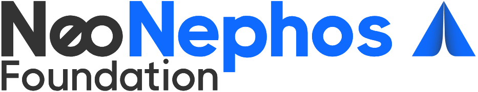

   

    
  

  <h1> K8s Controller & API federating Telco and Cloud.</h1>
  <!-- Logos Section -->
 

  <!-- Badge Section-->
  

    
    &nbsp;
    
  

<!--  Project Details -->
| 🛠️ **Project** | **NeoNephos-Katalis** |
| :--- | :--- |
| 📝 **Description** | K8s Controller & API federating Telco and Cloud |
| ⚖️ **License** | [Apache 2.0](LICENSE) |
| 📦 **Repository** | [neonephos-katalis/opg-ewbi-operator](https://github.com/neonephos-katalis/opg-ewbi-operator) |
| 📖 **Documentation** | [neonephos-katalis/opg-ewbi-documentation](https://github.com/neonephos-katalis/opg-ewbi-documentation) |
| 📖 **LFX Insights** | [Katalis](https://insights.linuxfoundation.org/project/katalis?timeRange=past365days&start=2025-10-07&end=2026-10-07)
| 🟢 **Status** | Active |

## 🧐 What is Katalis?

Katalis is embedded in the Linux Foundation Europe Project NeoNephos. The NeoNephos Foundation is building an open, secure, and interoperable cloud-edge continuum, empowering stakeholders to collaborate and innovate for Europe’s digital future.

This project is part of activities carried out within the Important Project of Common European Interest on Next Generation Cloud Infrastructure and Services (IPCEI-CIS), an EU initiative to build a sovereign, interoperable and energy-efficient cloud‑to‑edge infrastructure in Europe.

Katalis is inspired by the word "Catalyst", symbolizing transformation, acceleration, and orchestration—key concepts in federated Telco and Kubernetes infrastructure.

If we break it down into a meaningful acronym related to your project’s goals, KATALIS could stand for:
KATALIS – A Conceptual Acronym:
* K – Kubernetes (Cloud-native Orchestration)
* A – API (Bridging Telco APIs and Cloud Provider APIs)
* T – Telecom (Industry Focus)
* A – Automation (Seamless and Automated)
* L – Link (Federation and Integration)
* I – Interoperability (Unifying Telco & IT Cloud Resource Provisioning)
* S – Synchronization (Federated Resource Management)

This project aims to create to bridge between both worlds within the context of [IPCEI-CIS](https://competition-policy.ec.europa.eu/state-aid/ipcei/approved-ipceis/cloud_en)
and [8ra](https://www.8ra.com/ipcei-cis) european research programs umbrella.

It should enable a cloud edge continuum in both directions:
- The consumption of telco operator compute/storage resources from gardener controlled environments, i.E. to deploy application fragments close the edge of a UE to fulfill latency requirements
- The extension of telco operator federation to software cloud providers resources

[GSMA Operator Platform](https://www.gsma.com/solutions-and-impact/technologies/networks/operator-platform-hp/)
defines a common platform exposing (telco) operator services/capabilities to customers/developers in the 5G-era
in a connect once, connect to many models by a standardisation of a common architecture using a
platform approach for exposing these services.

## 🎯 Purpose
The goal is to ensure that all contributors, members, and stakeholders share a **transparent and common understanding** of how decisions are made, how work is organized, and how the project evolves.

## ⚖️ Governance 
The project follows an **open governance model** inspired by Linux Foundation best practices.
- **Steering Committee (SC)**
  - Responsible for strategic direction, alignment with EU initiatives, and coordination with other projects (e.g., Gardener, OCM, ApeiroRA).
  - Membership: Representatives from participating organizations.
- **Technical Steering Committee (TSC)**
  - Oversees technical decisions, architecture specifications, and interoperability efforts.
  - Membership: Maintainers elected by contributors.
- **Working Groups (LF)**
  - Topic-specific groups (e.g., Security, Cloud–Edge Federation, API Standardization).
  - Open to all contributors.
- **Community**
  - Contributions are open via pull requests, issues, and discussions.
  - All technical contributions require **two maintainer approvals** before merging.

## 📜 Principles
1. **Openness** – Participation is open to all stakeholders.
2. **Transparency** – All decisions are documented and accessible.
3. **Meritocracy** – Influence is earned through contribution.
4. **Neutrality** – Governance is vendor-neutral, focused on interoperability.
5. **Security by Design** – Governance ensures compliance with EU standards (e.g., GDPR, NIS2).

## 🤝🏻 Decision Making
- **Consensus first** – seek agreement in working groups.
- **Lazy consensus** – silence means consent after 5 business days.
- **Escalation** – unresolved issues can be raised to the TSC, then the SC.

## 🗣 How to Engage
- Join discussions in GitHub **Issues** & **Discussions**
- Propose changes via **Pull Requests**
- Participate in **Working Groups**

## 📚 References
- [GSMA E/WBI API ](https://www.gsma.com/solutions-and-impact/technologies/networks/wp-content/uploads/2012/10/OPG.04-v7.0-Federation_API_Jul2026.zip)
- [GSMA OPG. 02 – Requirements and Architecture](https://www.gsma.com/solutions-and-impact/technologies/networks/gsma_resources/opg-02-requirements-and-architecture/)
- [GSMA OPG. 04 – East-Westbound Interface APIs](https://www.gsma.com/solutions-and-impact/technologies/networks/gsma_resources/opg-04-east-westbound-interface-apis/)
- [GSMA OPG. 11 – East-Westbound Interface APIs](https://www.gsma.com/solutions-and-impact/technologies/networks/gsma_resources/opg-11-operator-platform-requirements-for-edge-services-2/)
-  [GSMA OPG.12 – Operator Platform: Requirements for Network as a Service](https://www.gsma.com/solutions-and-impact/technologies/networks/gsma_resources/opg-12-operator-platform-requirements-for-network-as-a-service/)

